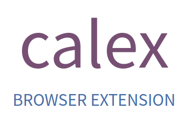

  

A browser extension that shows event descriptions in Google Calendar.

Descriptions are displayed in:

- the agenda view
- the search results

## FAQ

### What about day/week/month/year views?

There is no plan to update those pages as there is not enough space on them to display event descriptions content.

## Installation

Install from:

- [Chrome Web Store](https://chrome.google.com/webstore/detail/kalendario-for-google-calendar/ccoehijdbponhcemihobmdpaeenmgchg).
- [Firefox Add-ons Portal](https://addons.mozilla.org/firefox/addon/kalendario-for-google-calendar/)

### Browsers

Tested in:

- [Chrome](https://www.google.com/chrome/)
- [Firefox](https://www.mozilla.org/firefox/download/)
- [Opera](https://www.opera.com/) (you can use Chrome extensions trough [Download Chrome Extensions](https://addons.opera.com/en/extensions/details/download-chrome-extension-9/) addon)
- [Vivaldi](https://vivaldi.com/)

## Development

- clone this repository `git clone git@github.com:crazko/kalendario.git`
- install all dependencies `npm install`
- create `.env` file with `cp .env.example .env` and put app variables
  - visit [Google API Console](https://console.developers.google.com/)
  - create new project
  - enable **Google Calendar API**
  - add scope `https://www.googleapis.com/auth/calendar.readonly` in **OAuth consent screen**
  - create credentials under Credentials, select **OAuth client ID** and choose **Web application**
  - add `CLIENT_ID` and `CLIENT_SECRET` to the `.env`
- build and watch source files with `npm start`
- enable **Developer mode** in your browser
- load `./dist` directory as an unpacked extension

### Available commands

| `npm run ...` | Description                         |
| ------------- | ----------------------------------- |
| `start`       | Start the app and watch for changes |
| `dev`         | Make a development build            |
| `build`       | Make a production build             |
| `clear`       | Remove `./dist` folder              |
