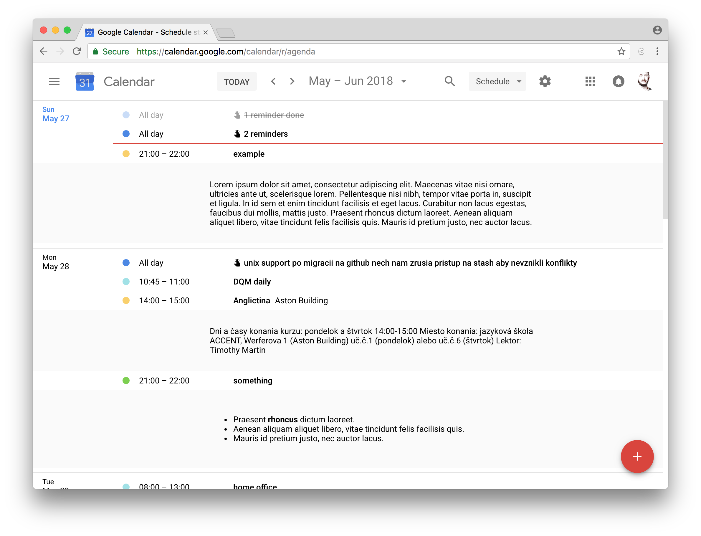

# Calex Classic

A browser extension that shows events' descriptions in Google Calendar.

> **Note:** In October 2017 Google [launched new version](https://9to5google.com/2017/10/17/google-calendar-web-material-design-update/) of Calendar, which this extension isn't compatible with, but still works with older "Classic" Calendar as long as it is available. See the [new version](https://github.com/crazko/calex) of the extension.

## Installation

Install from [Chrome Web Store](https://chrome.google.com/webstore/detail/calex-for-google-calendar/ccoehijdbponhcemihobmdpaeenmgchg).

## Features

*   shows descriptions in:
    *   the agenda view
    *   the search results
*   supports markdown format thanks to [showdownjs/showdown](https://github.com/showdownjs/showdown)

### Browsers

Tested in:

*   [Chrome](https://www.google.com/chrome/)
*   [Opera](https://www.opera.com/) (you can use Chrome extensions trough [Download Chrome Extensions](https://addons.opera.com/en/extensions/details/download-chrome-extension-9/) addon)
*   [Vivaldi](https://vivaldi.com/)

## Development

*   clone this repository
*   checkout a new branch
*   load directory as an unpacked extension (be sure you have enabled **developer mode**)
*   you have to reload extension on every change you made
